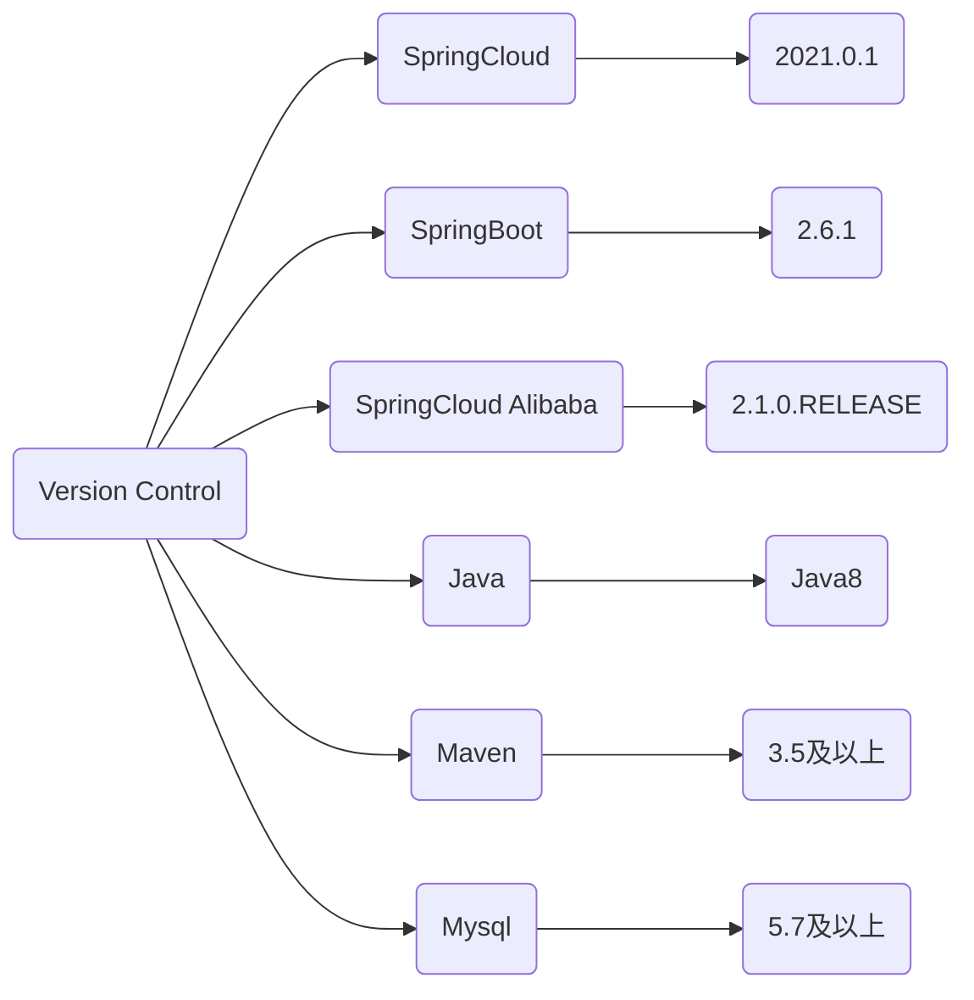

# 1. SpringBoot和SpringCloud的版本选型


可以看到，对应版本有很高的要求，因此如果我需要使用最新的 `2021.0.x` 版本，那么 springboot 的版本就需要是 `2.6.x`

更加具体的版本对应：
[spring 版本对应关系](https://start.spring.io/actuator/info)

得到的是一个 json 串，进行解析后可以看到：

```json
{
	"git": {
		"branch": "af724b5c27a7317a2f111739cf810d9cb526c1e0",
		"commit": {
			"id": "af724b5",
			"time": "2022-01-07T09:27:13Z"
		}
	},
	"build": {
		"version": "0.0.1-SNAPSHOT",
		"artifact": "start-site",
		"versions": {
			"spring-boot": "2.6.2",
			"initializr": "0.12.0-SNAPSHOT"
		},
		"name": "start.spring.io website",
		"time": "2022-01-07T09:28:11.771Z",
		"group": "io.spring.start"
	},
	"bom-ranges": {
		"azure": {
			"3.2.0": "Spring Boot >=2.3.0.M1 and <2.4.0-M1",
			"3.5.0": "Spring Boot >=2.4.0.M1 and <2.5.0-M1",
			"3.10.0": "Spring Boot >=2.5.0.M1 and <2.6.0-M1"
		},
		"codecentric-spring-boot-admin": {
			"2.4.3": "Spring Boot >=2.3.0.M1 and <2.5.0-M1",
			"2.5.5": "Spring Boot >=2.5.0.M1 and <2.6.0-M1",
			"2.6.0": "Spring Boot >=2.6.0.M1 and <2.7.0-M1"
		},
		"solace-spring-boot": {
			"1.1.0": "Spring Boot >=2.3.0.M1 and <2.6.0-M1"
		},
		"solace-spring-cloud": {
			"1.1.1": "Spring Boot >=2.3.0.M1 and <2.4.0-M1",
			"2.1.0": "Spring Boot >=2.4.0.M1 and <2.6.0-M1"
		},
		"spring-cloud": {
			"Hoxton.SR12": "Spring Boot >=2.2.0.RELEASE and <2.4.0.M1",
			"2020.0.5": "Spring Boot >=2.4.0.M1 and <2.6.0-M1",
			"2021.0.0-M1": "Spring Boot >=2.6.0-M1 and <2.6.0-M3",
			"2021.0.0-M3": "Spring Boot >=2.6.0-M3 and <2.6.0-RC1",
			"2021.0.0-RC1": "Spring Boot >=2.6.0-RC1 and <2.6.1",
			"2021.0.0": "Spring Boot >=2.6.1 and <2.6.3-SNAPSHOT",
			"2021.0.1-SNAPSHOT": "Spring Boot >=2.6.3-SNAPSHOT and <2.7.0-M1"
		},
		"spring-cloud-gcp": {
			"2.0.7": "Spring Boot >=2.4.0-M1 and <2.6.0-M1"
		},
		"spring-cloud-services": {
			"2.3.0.RELEASE": "Spring Boot >=2.3.0.RELEASE and <2.4.0-M1",
			"2.4.1": "Spring Boot >=2.4.0-M1 and <2.5.0-M1",
			"3.3.0": "Spring Boot >=2.5.0-M1 and <2.6.0-M1"
		},
		"spring-geode": {
			"1.3.12.RELEASE": "Spring Boot >=2.3.0.M1 and <2.4.0-M1",
			"1.4.13": "Spring Boot >=2.4.0-M1 and <2.5.0-M1",
			"1.5.7": "Spring Boot >=2.5.0-M1 and <2.6.0-M1",
			"1.6.1": "Spring Boot >=2.6.0-M1 and <2.7.0-M1"
		},
		"vaadin": {
			"14.8.1": "Spring Boot >=2.1.0.RELEASE and <2.8.0-M1"
		},
		"wavefront": {
			"2.0.2": "Spring Boot >=2.1.0.RELEASE and <2.4.0-M1",
			"2.1.1": "Spring Boot >=2.4.0-M1 and <2.5.0-M1",
			"2.2.2": "Spring Boot >=2.5.0-M1 and <2.7.0-M1"
		}
	},
	"dependency-ranges": {
		"native": {
			"0.9.0": "Spring Boot >=2.4.3 and <2.4.4",
			"0.9.1": "Spring Boot >=2.4.4 and <2.4.5",
			"0.9.2": "Spring Boot >=2.4.5 and <2.5.0-M1",
			"0.10.0": "Spring Boot >=2.5.0-M1 and <2.5.2",
			"0.10.1": "Spring Boot >=2.5.2 and <2.5.3",
			"0.10.2": "Spring Boot >=2.5.3 and <2.5.4",
			"0.10.3": "Spring Boot >=2.5.4 and <2.5.5",
			"0.10.4": "Spring Boot >=2.5.5 and <2.5.6",
			"0.10.5": "Spring Boot >=2.5.6 and <2.5.9-SNAPSHOT",
			"0.10.6-SNAPSHOT": "Spring Boot >=2.5.9-SNAPSHOT and <2.6.0-M1",
			"0.11.0-M1": "Spring Boot >=2.6.0-M1 and <2.6.0-RC1",
			"0.11.0-M2": "Spring Boot >=2.6.0-RC1 and <2.6.0",
			"0.11.0-RC1": "Spring Boot >=2.6.0 and <2.6.1",
			"0.11.0": "Spring Boot >=2.6.1 and <2.6.2",
			"0.11.1": "Spring Boot >=2.6.2 and <2.6.3-SNAPSHOT",
			"0.11.2-SNAPSHOT": "Spring Boot >=2.6.3-SNAPSHOT and <2.7.0-M1"
		},
		"okta": {
			"1.4.0": "Spring Boot >=2.2.0.RELEASE and <2.4.0-M1",
			"1.5.1": "Spring Boot >=2.4.0-M1 and <2.4.1",
			"2.0.1": "Spring Boot >=2.4.1 and <2.5.0-M1",
			"2.1.4": "Spring Boot >=2.5.0-M1 and <2.6.0-M1"
		},
		"mybatis": {
			"2.1.4": "Spring Boot >=2.1.0.RELEASE and <2.5.0-M1",
			"2.2.1": "Spring Boot >=2.5.0-M1"
		},
		"camel": {
			"3.5.0": "Spring Boot >=2.3.0.M1 and <2.4.0-M1",
			"3.10.0": "Spring Boot >=2.4.0.M1 and <2.5.0-M1",
			"3.13.0": "Spring Boot >=2.5.0.M1 and <2.6.0-M1",
			"3.14.0": "Spring Boot >=2.6.0.M1 and <2.7.0-M1"
		},
		"picocli": {
			"4.6.2": "Spring Boot >=2.4.0.RELEASE and <2.6.0-M1"
		},
		"open-service-broker": {
			"3.2.0": "Spring Boot >=2.3.0.M1 and <2.4.0-M1",
			"3.3.1": "Spring Boot >=2.4.0-M1 and <2.5.0-M1",
			"3.4.0-M2": "Spring Boot >=2.5.0-M1 and <2.6.0-M1"
		}
	}
}
```


如果我要使用 springcloud 的 `2021.0.0` 版本，那么我的 springboot 版本需要在 2.6.1 版本到 2.6.3 版本之间。

那么我们直接上最新的稳定版



# 2. 组件选型


可以看到，红色的是已经不更新的并且不维护了的组件，黄色的是可以使用的但是不是最好的组件，绿色的是最推荐使用的组件，也是我们本次学习的重点组件。


# 3. 新建工程
## 字符编码设置为UTF-8


## 配置注解生效


## 父工程pom.xml文件

### dependencyManagement和dependencies的区别
使用`pom.xml`中的dependencyManagement元素能让所有在子项目中引用一个依赖而不用显式的列出版本号。Maven会沿着父子层次向上走，知道找到一个拥有dependencyManagement元素的项目，然后它就会使用这个dependencyManagement元素中指定的版本号。

 - dependencyManagement里只是声名依赖，==并不实现引入==，因此子项目需要显式地声名需要的依赖（也就是需要在`<dependencies>`中引入`<dependency>`） 
- 如果不在子项目中声明依赖，是不会从父项目中继承下来的；只有在子项目中写了该依赖项，并且没有指定具体版本，才会从父项目中继承该项，并且version和scope都读取自父pom
- 如果子项目中指定了版本号，那么会使用子项目中指定的jar版本

最终的 pom 文件如下：
```xml
<?xml version="1.0" encoding="UTF-8"?>
<project xmlns="http://maven.apache.org/POM/4.0.0"
         xmlns:xsi="http://www.w3.org/2001/XMLSchema-instance"
         xsi:schemaLocation="http://maven.apache.org/POM/4.0.0 http://maven.apache.org/xsd/maven-4.0.0.xsd">
    <modelVersion>4.0.0</modelVersion>
    <version>1.0.0-SNAPSHOT</version>
    <artifactId>SpringCloud2021</artifactId>
    <groupId>com.coachhe.springcloud</groupId>
    <packaging>pom</packaging>

    <parent>
        <artifactId>spring-boot-parent</artifactId>
        <groupId>org.springframework.boot</groupId>
        <version>2.2.2.RELEASE</version>
    </parent>

    <modules>
        <module>cloud-provider-payment8001</module>
        <module>cloud-consumer-order80</module>
        <module>cloud-api-commons</module>
    </modules>

    <!-- 统一管理jar包版本 -->
    <properties>
        <project.build.sourceEncoding>UTF-8</project.build.sourceEncoding>
        <maven.compiler.source>1.8</maven.compiler.source>
        <maven.compiler.target>1.8</maven.compiler.target>
        <lombok.version>1.16.18</lombok.version>
        <druid.version>1.1.16</druid.version>
        <spring.boot.version>2.6.1</spring.boot.version>
        <spring.cloud.version>2021.0.0</spring.cloud.version>
        <spring.cloud.alibaba.version>2021.1</spring.cloud.alibaba.version>
        <mybatis.spring.boot.version>1.3.0</mybatis.spring.boot.version>
    </properties>

    <!-- 子模块继承之后，提供作用：锁定版本+子modlue不用写groupId和version  -->
    <dependencyManagement>
        <dependencies>
            <!--spring boot 2.6.1-->
            <dependency>
                <groupId>org.springframework.boot</groupId>
                <artifactId>spring-boot-dependencies</artifactId>
                <version>${spring.boot.version}</version>
                <type>pom</type>
                <scope>import</scope>
            </dependency>
            <!--spring cloud 2021.0.0-->
            <dependency>
                <groupId>org.springframework.cloud</groupId>
                <artifactId>spring-cloud-dependencies</artifactId>
                <version>${spring.cloud.version}</version>
                <type>pom</type>
                <scope>import</scope>
            </dependency>
            <!--spring cloud alibaba 2021.1-->
            <dependency>
                <groupId>com.alibaba.cloud</groupId>
                <artifactId>spring-cloud-alibaba-dependencies</artifactId>
                <version>${spring.cloud.alibaba.version}</version>
                <type>pom</type>
                <scope>import</scope>
            </dependency>
            <dependency>
                <groupId>com.alibaba</groupId>
                <artifactId>druid</artifactId>
                <version>${druid.version}</version>
            </dependency>
            <dependency>
                <groupId>org.mybatis.spring.boot</groupId>
                <artifactId>mybatis-spring-boot-starter</artifactId>
                <version>${mybatis.spring.boot.version}</version>
            </dependency>
            <dependency>
                <groupId>org.projectlombok</groupId>
                <artifactId>lombok</artifactId>
                <version>${lombok.version}</version>
                <optional>true</optional>
            </dependency>
        </dependencies>
    </dependencyManagement>

    <build>
        <plugins>
            <plugin>
                <groupId>org.springframework.boot</groupId>
                <artifactId>spring-boot-maven-plugin</artifactId>
                <configuration>
                    <fork>true</fork>
                    <addResources>true</addResources>
                </configuration>
            </plugin>
        </plugins>
    </build>


</project>
```

## 构建Rest微服务工程
在这里我们搭建的是一个微服务消费订单模块

### cloud-provider-payment8001
这是一个微服务提供者支付模块

此时我们来观察一下父工程的pom文件：


可以看到，父工程下多了一个modules模块，里面的内容就是我们新建的子模块

建表：
```mysql
MySQL [(none)]> use cloudLearn;
Database changed
MySQL [cloudLearn]> create table payment ( id bigint(20) NOT NULL AUTO_INCREMENT COMMENT 'ID', serial varchar(200) DEFAULT '', PRIMARY KEY(id) ) ENGINE=InnoDB AUTO_INCREMENT=1 DEFAULT CHARSET=UTF8
Query OK, 0 rows affected (0.00 sec)
```


## 自动热部署


